# Hatsune Miku! Список для ознакомления
 

**Hatsune Miku** (**初音ミク**, транскрипция: Хацунэ Мику, Хатсуне Мику)  — персонаж-маскот одноимённого голосового банка. Входит в состав Character Vocal Series. 

### Общая информация

Несмотря на то, что от версии к версии внешность Hatsune Miku теряла и приобретала некоторые детали, основные черты всегда остаются неизменными. Такими чертами является худое телосложение, большие голубые глаза, длинные хвосты голубого цвета и футуристическая школьная форма, состоящая из рубашки без рукавов, нарукавников, заколок, галстука, короткой юбки и чулков с обувью.

На одежде стоит заострить внимание более подробно, поскольку здесь всё хоть и более-менее стабильно, но всё же некоторые детали меняются в зависимости от версии персонажа. Прежде всего это касается цветовой гаммы элементов одежды. В большинстве версий обувь, чулки и рукава имеют чёрный цвет, юбка — чёрная с голубым обрамлением, а заколки — сиреневые. Разительно отличаются только Append-версия, где галстук также белый, заколки чёрные, а юбки и обуви нет вообще и английская версия для [VOCALOID3](https://vocaloid.fandom.com/ru/wiki/VOCALOID3 "VOCALOID3"), где все элементы чёрного цвета были окрашены в тёмно-синий. Что же касается рубашки, то почти все существующие каноничные версии персонажа имеют рубашку белого цвета и только у стандартной V2-версии она серая.

### История создания

Иллюстратором оригинального внешнего вида Hatsune Miku был KEI. Когда он приступил к работе над внешним видом перед ним была поставлена задача создать иллюстрации Miku, основываясь на цветовой гамме сине-зелёной подписи синтезаторов, а также изобразить её как андроида. Crypton также предложили свою концепцию, однако, им нелегко было объяснить своё видение вокалоида. KEI сказал, что не может нарисовать "поющий компьютер", ибо он даже не имел представления о том, как выглядел синтезатор. На всю работу у него ушло около [месяца](https://web.archive.org/web/20080512071404/http://www.p-tina.net/interview/97). Последующие же версии были созданы руками Masaki Asai (Append-версия), iXima (стандартные вариации для третьего и четвёртого поколения), Zain (английская V3) и Mamenomoto (китайская V4).

Цифровой дизайн юбки и ботинок Miku основан на программных цветах синтезатора, а полоски изображают полоски, взятые из программы по просьбе Crypton. Часть её внешнего вида основана на моделях клавиатуры YAMAHA, особенно [DX-100](vocaloidotaku.net/index.php?/topic/28638-source-of-mikus-design/) и DX-7. Квадратики вокруг хвостиков являются футуристичными ленточками, созданными из специального материала, который парит в воздухе. Как видно из артов Мику KEI, они способны держать хвостики Мику при этом не соприкасаясь с самими волосами. Также эти самые ленточки считаются деталью, которую сложнее всего изобразить в косплее персонажа.

### Продвижение
По началу система маркетинга Hatsune Miku ничем не отличалась от аналогичной у [KAITO](https://vocaloid.fandom.com/ru/wiki/KAITO_(%D0%BF%D0%B5%D1%80%D1%81%D0%BE%D0%BD%D0%B0%D0%B6) "KAITO (персонаж)") и [MEIKO](https://vocaloid.fandom.com/ru/wiki/MEIKO_(%D0%BF%D0%B5%D1%80%D1%81%D0%BE%D0%BD%D0%B0%D0%B6) "MEIKO (персонаж)"), посему большая часть продвижения происходила с помощью DTM MAGAZINE, поскольку читатели данного журнала в своё время оказали большое влияние на распространение вышеуказанных персонажей. Единственным же заранее запланированным ходом был выпуск диска с демо-версией голосового банка Hatsune Miku вместе с выпуском журнала за ноябрь 2007 года, чей тираж был быстро распродан. В то время как вышеуказанный голосовой банк был доступен для предзаказа также было отмечено, что [MEIKO](https://vocaloid.fandom.com/ru/wiki/MEIKO_(%D0%BF%D0%B5%D1%80%D1%81%D0%BE%D0%BD%D0%B0%D0%B6) "MEIKO (персонаж)") и [KAITO](https://vocaloid.fandom.com/ru/wiki/KAITO_(%D0%BF%D0%B5%D1%80%D1%81%D0%BE%D0%BD%D0%B0%D0%B6) "KAITO (персонаж)") не имеют перспектив получения обновлений, и что Miku будет исполнять их роли в [будущем](https://sonicwire.com/news/blog/2007/08/vocaloid2-8). Кроме того, первоначально Hatsune Miku была нацелена только на профессиональных продюсеров поскольку [любительский](https://sonicwire.com/news/blog/2007/05/vocaloid2-3) рынок и рынок отаку тогда ещё только формировались.

Не смотря на всё вышеперечисленное, Hatsune Miku ждал коммерческий успех, в следствии чего были предприняты новые маркетинговые ходы. Так, например, было выпущено несколько руководств, а также линейка журналов, посвящённые исключительно её вокалу. Этот тип технического освещения стал возможен даже спустя долгое время после первоначального выпуска Мику, благодаря чему методы адаптации ее вокала наиболее хорошо задокументированы среди вокалоидов эры VOCALOID2. В марте 2012 года, согласно подсчётам Исследовательского института Номура, общая прибыль за всё время продажи лицензионных товаров под брендом "Hatsune Miku" достигла отметки в [10 000 000 000 иен](http://www.sankeibiz.jp/business/news/120327/bsg1203270754009-n3.htm).

Поскольку успех ее голосового банка привел к расширению маркетинговых возможностей, большая часть массового маркетинга пришла после ее первоначального выпуска в ответ на ее популярность. На данный момент имя Мику является наиболее узнаваемым среди всех вокалоидов, из-за чего оно более активно используется [Crypton Future Media, Inc.](https://vocaloid.fandom.com/ru/wiki/Crypton_Future_Media,_Inc. "Crypton Future Media, Inc.") для продвижения собственных проектов, несмотря на наличие авторских прав и на некоторых других персонажей. В 2011 году началось продвижение Мику на американском рынке, в рамках которого 7 мая USAmazon разместил анонс популярной песни Supercell "World is Mine" в качестве сингла. Когда песня поступила в продажу, она заняла 7-е место в списке 10 лучших синглов мира в iTunes за [первую неделю продаж](https://www.animenewsnetwork.com/interest/2011-05-15/supercell/miku-song-in-u.s-itunes-world-top-10?ann-edition=uk). 26 июня 2012 года Hatsune Miku была зарегистрирована как [товарный знак](https://trademark.trademarkia.com/hatsune-miku-79106369.html).

На данный момент изображение Мику широко используется для продвижение продукции разного вида: с её изображением создавались фигурки, нотные тетради, книги, журналы а также многие другие товары. Кроме того, изображение Хацунэ Мику наносились на автомобили [BMW Z4 класса GT300 Super GT сезона 2008 года](https://www.animenewsnetwork.com/news/2009-08-23/hatsune-miku-virtual-idol-performs-live-before-25000) и [Toyota Corolla в 2011 году](https://www.crunchyroll.com/ru/anime-news/2011/07/21/crn-interview-the-creators-of-hatsune-miku). Также с 2009 года проходят "живые" концерты Мику с использованием технологии проецирования псевдотрёхмерного изображения. Помимо этого Hatsune Miku является героиней ряда игр на разных платформах, а также не каноничной манги, созданной KEI: メーカー非公式 初音みっくす.

# Список для ознакомления* 
***далеко не полный, новые редакции ожидайте в дальнейшем**
## Классика (J-POP, EasyPop, DancePop, Electro, Techno)

#### 2008
- [Cleaning Switch (Очищающий переключатель)](https://www.youtube.com/watch?v=5dhcFAhOcbo)
- [Anger (Гнев)](https://www.youtube.com/watch?v=jNFCsJ16crc)
- [Houkiboshi (Комета)](https://www.youtube.com/watch?v=pPhGeDlaMAQ)

#### 2009
- [ぽっぴっぽ (Po pi po)](https://www.youtube.com/watch?v=mco3UX9SqDA) **NEW**
- [Nebula feat. Hatsune Miku](https://www.youtube.com/watch?v=hoLu7c2XZYU)

#### 2010
- [MATORYOSHKA](https://www.youtube.com/watch?v=HOz-9FzIDf0) **NEW**
- [Rolling Girl (Катящаяся девачка)](https://www.youtube.com/watch?v=NIqm73xsias) **NEW**
- [Electric Love feat. Hatsune Miku (Электрическая любовь)](https://www.youtube.com/watch?v=fWIbhwMDigM)

#### 2011
- [Downloader (Загрузчик)](https://www.youtube.com/watch?v=zQRfQximhCU)
- [Strobe Light (Вспышка света)](https://www.youtube.com/watch?v=7sKs7INaEoA)
- [Baby Maniacs feat. Hatsune Miku (Крошки-маньяки)](https://www.youtube.com/watch?v=ca7QqLHEiLA)
- [Chime (Гармония)](https://www.youtube.com/watch?v=vrshk9Z2kV8)
- [EDEN](https://www.youtube.com/watch?v=yyUCtd6rrWw)
- [Sekiranun Graffiti ft. Hastsune Miku (Граффити грозовых туч)](https://www.youtube.com/watch?v=XKOoIAYSkZQ)
- [Sweet Devil feat. Hatsune Miku (Милый дьявол)](https://www.youtube.com/watch?v=atXcWO54Ek0)

#### 2012
- [Fake Doll (Поддельная кукла)](https://www.youtube.com/watch?v=Z1VhvAIa3UA)
- [Weekender Girl (Отдыхающая девушка)](https://www.youtube.com/watch?v=06d8SwcSm_Q)
- [Gift nor Art (Подарок и искусство)](https://www.youtube.com/watch?v=jZjONCvSjr0)
- [Re Boot (Перезагрузка)](https://www.youtube.com/watch?v=3BFvN-idN1s)
- [Bacterial Contamination (Бактериальное заражение)](https://www.youtube.com/watch?v=tktcOUi-x-A)
- [FREELY TOMORROW (Свободное завтра)](https://www.youtube.com/watch?v=KmvydnVTriE)
- [Tell Your World (Расскажи о своём мире)](https://www.youtube.com/watch?v=PqJNc9KVIZE)
- [Yumeyume (Мечта, мечта)](https://www.youtube.com/watch?v=07r67gGbtLQ)
- [Initiation feat. Hatsune Miku (Посвящение)](https://www.youtube.com/watch?v=dIfLTw3tbE8)

#### 2013
- [Oosouji (Уборка)](https://www.youtube.com/watch?v=HJIFqUxi4ko)
- [HORIZON feat. Hatsune Miku (Горизонт)](https://www.youtube.com/watch?v=4jhjgoFv4D4)
- [Sagashimono (Искомые вещи)](https://www.youtube.com/watch?v=EKMiScr_Quc)
- [Redial (Повторный набор)](https://www.youtube.com/watch?v=243vPl8HdVk)
- [GAME OVER feat. Hatsune Miku (Игра окончена)](https://www.youtube.com/watch?v=B5fIvQts65I)
- [TRAPxTRAP feat. Hatsune Miku](https://www.youtube.com/watch?v=c2fqMoTq_tQ)

#### 2014
- [Burenai Ai de (С ясным взглядом)](https://www.youtube.com/watch?v=8kX5_69sO8Q)
- [Rakugaki Picasso (Граффити Пикассо)](https://www.youtube.com/watch?v=Qqh_9gTk1c4)
- [Decorator (Декоратор)](https://www.youtube.com/watch?v=zweVJrnE1uY)
- [E no Umakatta Tomodachi (Друзья с картинок)](https://www.youtube.com/watch?v=0tluBqFbAgQ)
- [Twinkle World feat. Hatsune Miku (Сверкающий мир)](https://www.youtube.com/watch?v=NiIVTXTuQug)
- [Carry Me Off feat. Hatsune Miku (Унеси меня)](https://www.youtube.com/watch?v=UGG7tUMg77A)

#### 2015
- [B Who I Want 2 B (Быть тем, кем я хочу)](https://www.youtube.com/watch?v=oNxdk5oxbTM)
- [Hand in Hand (Рука об руку)](https://www.youtube.com/watch?v=RKtoreimcQ8)
- [Desktop Cinderella feat. Hatsune Miku (Золушка на рабочем столе)](https://www.youtube.com/watch?v=rQCPXcckCaQ)
- [Little Scarlet Bad Girl feat. Hatsune Miku (Маленькая Скарлет — плохая девочка)](https://www.youtube.com/watch?v=I_bs61WyzMk)

#### 2016
- [Hiyashite Narasou Okashi no Ii Oto (Едим «Pocky» вместе)](https://www.youtube.com/watch?v=0vLUg5RWpTo)
- [Blue Star feat. Hatsune Miku (Голубая звезда)](https://www.youtube.com/watch?v=xSnuVnOZd1U)
- [Miku ft. Hatsune Miku](https://www.youtube.com/watch?v=NocXEwsJGOQ)
- [Kimagure Mercy (Причудливое милосердие)](https://www.youtube.com/watch?v=o1iz4L-5zkQ)

#### 2017
- [Ohedo Julia-Night](https://www.youtube.com/watch?v=y3yyYYLyVzw)
- [Suna no Wakusei feat. Hatsune Miku (Песочная планета)](https://www.youtube.com/watch?v=AS4q9yaWJkI)

#### 2018
- [Greenlights Serenade (Серенада зеленых огней)](https://www.youtube.com/watch?v=XSLhsjepelI)

#### 2019
- [Lucky☆Orb feat. Hatsune Miku (Счастливый шар)](https://www.youtube.com/watch?v=AufydOsiD6M)
- [Ring no Seraph (Серафим на ринге)](https://www.youtube.com/watch?v=lWuJRRCTHrg)
#### 2020
#### 2021
- [Unsung Melodies (Невоспетые мелодии)](https://www.youtube.com/watch?v=P82j5OIcUUU) **NEW**
- [初音天地開闢神話 (Миф Хацунэ Тенчи Кайхо)](https://www.youtube.com/watch?v=8J6SMoVd5BY) **NEW**
- [AppleApple (ЯблокоЯблоко)](https://www.youtube.com/watch?v=7s4zX7zj6vs) **NEW**

## Продюссеры

### Utsu-P 

**Utsu-P** (**鬱P**, Дипрессия-P) (родился 1-ого Декабря 1990), - признанный продюсер, известный своими песнями в стиле вокаметалл.
Хотя вначале в его песнях была исключительно Мику, теперь он также использует Rin, GUMI и flower.
Он хорошо известен своими навыками управления голосом вокалойдов для исполнения выкриков (shouts), криков (screams) и ворчаний (grunts) с помощью фильтров и эффектов, а его мелодия обычно имеет тяжелую басовую линию.
Кроме того, его тексты часто несколько сложны, и их скрытый смысл трудно уловить с первого раза.
Он также является участником и основателем группы **Ohayougozaimasu** (**おはようございます**, **Доброе утро**), и продюссером идол-группы **Zsasz**.

### Aльбомы 

>Альбома CD-R здесь не будет, т.к треки из него есть в составе более новых альбомов, да и сам он является альбомом-компиляцией, поэтому не велика потеря (если сильно хочется, то добавлю). Альбом UNIQE ожидается 10 ноября 2021. 

#### DIARRHEA 2009
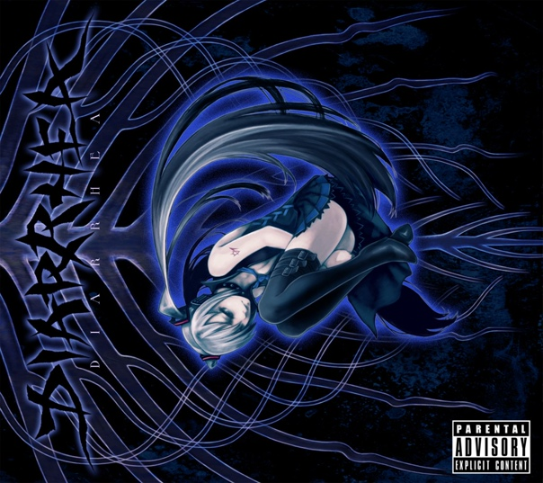

**YouTube:**  https://www.youtube.com/watch?v=LGTtqLW4Q-M
 1. Poison☆Apple【ぽいずん☆あっぷる】(Hatsune Miku) [0:00](https://www.youtube.com/watch?v=LGTtqLW4Q-M&t=0s) 
 2. Corpse Attack!!【Mukuro Attack!! / 骸Attack!!】(Hatsune Miku) [4:18](https://www.youtube.com/watch?v=LGTtqLW4Q-M&t=258s) 
 3. Anti-Digitalism【アンチ・デジタリズム】(Hatsune Miku) [8:14](https://www.youtube.com/watch?v=LGTtqLW4Q-M&t=494s) 
 4. Melancholy of Heavy Rain【Melancholy Gouu / メランコリー豪雨】(Hatsune Miku) [12:24](https://www.youtube.com/watch?v=LGTtqLW4Q-M&t=744s) 
 5. Shoegaze Life 【シューゲイズ・ライフ】(Hatsune Miku) [16:54](https://www.youtube.com/watch?v=LGTtqLW4Q-M&t=1014s) 
 6. Life with a Sex Doll【Seimei Zuke Dutchwife / 生命付ダッチワイフ】(Hatsune Miku) [21:14](https://www.youtube.com/watch?v=LGTtqLW4Q-M&t=1274s) 
 7. Desperate Society【Kakusa Shakai / かくさしゃかい】 (Hatsune Miku) [26:09](https://www.youtube.com/watch?v=LGTtqLW4Q-M&t=1569s) 
 8. Initiative【イニシアチブ】(Hatsune Miku) [29:49](https://www.youtube.com/watch?v=LGTtqLW4Q-M&t=1789s) 
 9. Welcome to the Love Hospital【Youkoso Renai Byouin he / ようこそ恋愛病院へ】(Hatsune Miku) [33:45](https://www.youtube.com/watch?v=LGTtqLW4Q-M&t=2025s) ❤
 10. SHIRONOIR (Hatsune Miku) [37:57](https://www.youtube.com/watch?v=LGTtqLW4Q-M&t=2277s) 
 11. Psychokinesis (Hatsune Miku) [42:23](https://www.youtube.com/watch?v=LGTtqLW4Q-M&t=2543s) 
12. DIARRHEA (Hatsune Miku) [46:46](https://www.youtube.com/watch?v=LGTtqLW4Q-M&t=2806s) ❤
13. Sky Burial【Chousou / 鳥葬】(Hatsune Miku) [51:24](https://www.youtube.com/watch?v=LGTtqLW4Q-M&t=3084s) 
14. Self-destruction【Jibaku / 自爆】(Hatsune Miku) [55:54](https://www.youtube.com/watch?v=LGTtqLW4Q-M&t=3354s)

#### TRAUMATIC 2010
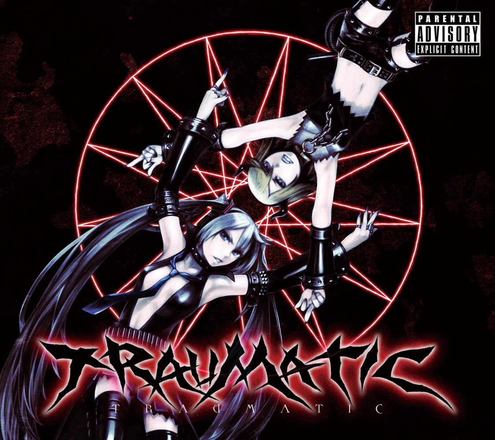

**YouTube:**  https://www.youtube.com/watch?v=YTjvf-HfqkA
1. Constipation Of Death (Kagamine Rin) [0:00](https://www.youtube.com/watch?v=YTjvf-HfqkA&t=0s)
2. Children's World【Kodomo No Sekai / 子供の世界】 (Kagamine Rin, Hatsune Miku) [4:07](https://www.youtube.com/watch?v=YTjvf-HfqkA&t=247s)
3. Adult's Toy【Otona No Omocha / オトナのオモチャ 】 (Kagamine Rin) [8:00](https://www.youtube.com/watch?v=YTjvf-HfqkA&t=480s)
4. THE DYING MESSAGE  (Kagamine Rin) [12:24](https://www.youtube.com/watch?v=YTjvf-HfqkA&t=744s) 
5. Public Toilet's Murky Water【Koushuu Benjo No Sumi / 公衆便所のスミ】 (Kagamine Rin) [16:59](https://www.youtube.com/watch?v=YTjvf-HfqkA&t=1019s) 
6. TRAUMATIC (Kagamine Rin) [21:00](https://www.youtube.com/watch?v=YTjvf-HfqkA&t=1260s)
7. Monkey Doesn't Know【Saru Wa Shiranai / 猿は知らない 】 (Kagamine Rin, Hatsune Miku) [21:34](https://www.youtube.com/watch?v=YTjvf-HfqkA&t=1294s) 
8. Black Showtime【 ブラック・ショータイム 】 (Kagamine Rin, Hatsune Miku) [25:03](https://www.youtube.com/watch?v=YTjvf-HfqkA&t=1503s)
9. potato-head in wonderland (Hatsune Miku) [28:52](https://www.youtube.com/watch?v=YTjvf-HfqkA&t=1732s) 
10. Wraith【Ikiryou / 生霊 】 (Kagamine Rin) [32:39](https://www.youtube.com/watch?v=YTjvf-HfqkA&t=1959s)
11. Parasite【Gaichuu / 害虫 】 (Hatsune Miku) [37:08](https://www.youtube.com/watch?v=YTjvf-HfqkA&t=2228s)
12. Sleepwalk【スリープウォーク】 (Hatsune Miku) [41:02](https://www.youtube.com/watch?v=YTjvf-HfqkA&t=2462s)
13. Doll【ドール】 (Hatsune Miku) [45:12](https://www.youtube.com/watch?v=YTjvf-HfqkA&t=2712s)
14. Heart Sutra Hardcore【Hannya Shingyou Hardcore / 般若心経ハードコア 】 (Hatsune Miku)[49:53](https://www.youtube.com/watch?v=YTjvf-HfqkA&t=2993s) 

#### MOKSHA 2012
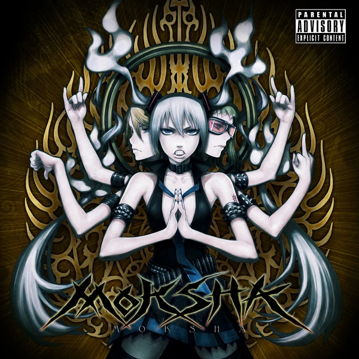

**YouTube:**  https://www.youtube.com/watch?v=zDz1RrOMbkk
1. MOKSHA (emancipation) [0:00](https://www.youtube.com/watch?v=zDz1RrOMbkk&t=0s) 
2. 暴動【Boudou / Riot】 (Kagamine Rin, Hatsune Miku) [0:47](https://www.youtube.com/watch?v=zDz1RrOMbkk&t=47s) 
3. 馬鹿はアノマリーに憧れる【Baka wa Anomaly ni Akogareru / The Fools Are Attracted By Anomaly】(Kagamine Rin) [4:14](https://www.youtube.com/watch?v=zDz1RrOMbkk&t=254s)
4. 再生【Saisei / Rebirth】(GUMI) [8:33](https://www.youtube.com/watch?v=zDz1RrOMbkk&t=513s) 
5. コロナ【Corona】(Kagamine Rin) [12:25](https://www.youtube.com/watch?v=zDz1RrOMbkk&t=745s) 
6. ダルマさんが転んだ気がする【Daruma-san ga Koronda Kigasuru / I think Dharma-san Fell】(GUMI) [16:21](https://www.youtube.com/watch?v=zDz1RrOMbkk&t=981s) 
7. ディス・イズ・ラブソング【This is Love Song】(GUMI) [20:08](https://www.youtube.com/watch?v=zDz1RrOMbkk&t=1208s) 
8. しゃよう【Shayou / For Company】(GUMI) [23:47](https://www.youtube.com/watch?v=zDz1RrOMbkk&t=1427s)
9. 幸福列車に乗ろう【Koufuku Ressha Ni Norou / Riding the Train of Happiness】(GUMI) [27:55](https://www.youtube.com/watch?v=zDz1RrOMbkk&t=1675s)
10. ナナシさんの背比べ【Nanashi-san no Seikurabe / Compared to the Back of the Anonymous】(GUMI) [31:52](https://www.youtube.com/watch?v=zDz1RrOMbkk&t=1912s)
11. 解脱【Gedatsu / Moksha】(Kagamine Rin) [35:16](https://www.youtube.com/watch?v=zDz1RrOMbkk&t=2116s)
12. ブラックホールアーティスト【Black Hole Artist】(GUMI, Kagamine Rin) [38:26](https://www.youtube.com/watch?v=zDz1RrOMbkk&t=2306s)
13. アレグラ【Allegra】(Kagamine Rin) [42:43](https://www.youtube.com/watch?v=zDz1RrOMbkk&t=2563s)
14. ダイヤに乱れはありません【Daiya ni Midare wa Arimasen / There is No Disorder in Diamond】(GUMI) [46:28](https://www.youtube.com/watch?v=zDz1RrOMbkk&t=2788s)
15. まっしろな毒【Masshiro na Doku / Pure White Poison】(GUMI) [50:33](https://www.youtube.com/watch?v=zDz1RrOMbkk&t=3033s) ❤
16. しましまメロディ【Shima Shima Melody / Striped Melody】(GUMI) [57:29](https://www.youtube.com/watch?v=zDz1RrOMbkk&t=3449s)

#### WARUFUZAKE 2013
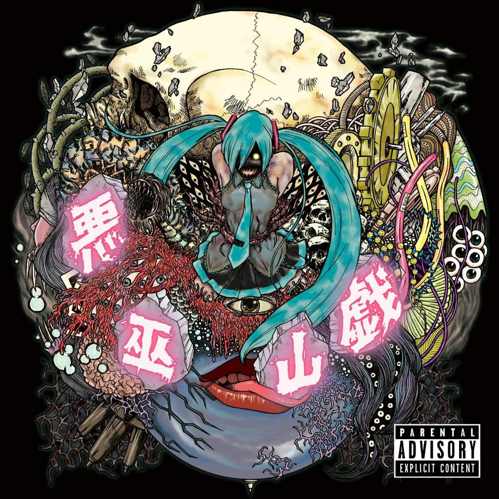

**YouTube:**  https://www.youtube.com/watch?v=ul0ACHQED2k
1. The Understanding of Nyan Silence【Nyan Shijima no Ryoukai / ニャン黙の了解】 (Hatsune Miku, Kagamine Rin) [0:00](https://www.youtube.com/watch?v=ul0ACHQED2k&t=0s) 
2. The Idiot admires Anomaly【Baka wa Anomaly no Akogareru / 馬鹿はアノマリーに憧れ】 (Kagamine Rin) [3:33](https://www.youtube.com/watch?v=ul0ACHQED2k&t=213s)
3. Parasite【Gaichuu / 害虫】 (Hatsune Miku, Kagamine Rin) [7:54](https://www.youtube.com/watch?v=ul0ACHQED2k&t=474s)
4. Ghost Under the Umbrella (GUMI) [11:49](https://www.youtube.com/watch?v=ul0ACHQED2k&t=709s)
5. E【え】 (GUMI) [16:31](https://www.youtube.com/watch?v=ul0ACHQED2k&t=991s)
6. Corona【コロナ】 (Kagamine Rin) [20:43](https://www.youtube.com/watch?v=ul0ACHQED2k&t=1243s)
7. Adult's Toy【Otona no Omocha / オトナのオモチャ】 (Kagamine Rin) [24:43](https://www.youtube.com/watch?v=ul0ACHQED2k&t=1483s)
8. B-CLASS HEROES (Hatsune Miku) [29:21](https://www.youtube.com/watch?v=ul0ACHQED2k&t=1761s)
9. The Pretty Girl's Prank【Kanbanmusume no Warufuzake / 看板娘の悪巫山戯】 (Hatsune Miku, Kagamine Rin, GUMI) [32:55](https://www.youtube.com/watch?v=ul0ACHQED2k&t=1975s)
10. Corpse Attack!!【Mukuro Attack!! / 骸Attack!!】 (Hatsune Miku) [36:41](https://www.youtube.com/watch?v=ul0ACHQED2k&t=2201s)
11. Cold【Kaze / 風邪】 (GUMI) [40:37](https://www.youtube.com/watch?v=ul0ACHQED2k&t=2437s)
12. THE DYING MESSAGE (Kagamine Rin) [46:19](https://www.youtube.com/watch?v=ul0ACHQED2k&t=2779s)

#### ALGORITM 2014
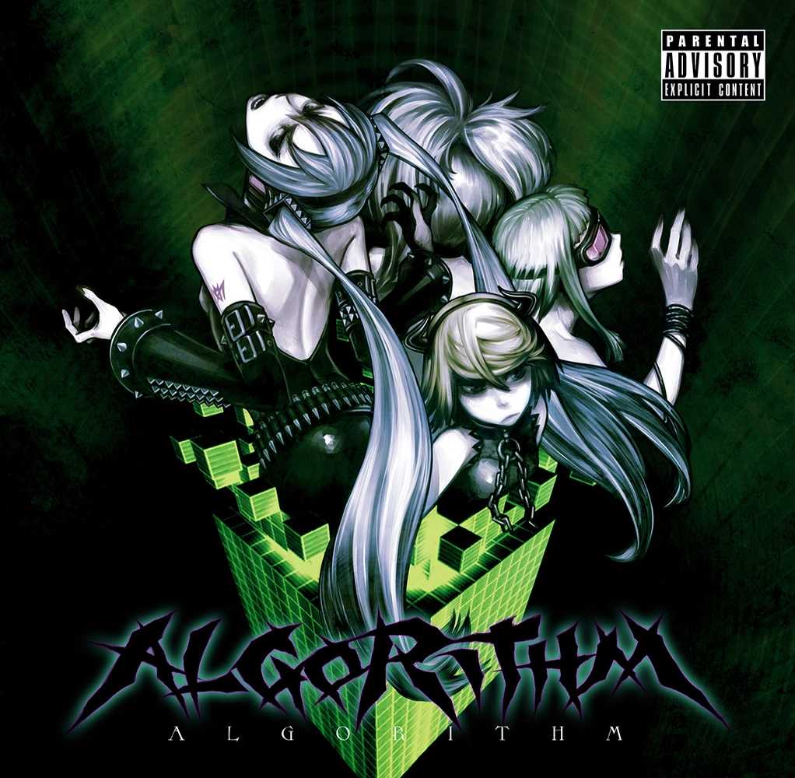

**YouTube:**  https://www.youtube.com/watch?v=OVVpxFp5lHw
1. A final fantasy【Owari no Fantajii / 終のファンタジー】(Hatsune Miku, GUMI) [0:00](https://www.youtube.com/watch?v=OVVpxFp5lHw&t=0s) ❤
2. Baby Death Match【ベイビー・デスマッチ】(Kagamine Rin)  [3:47](https://www.youtube.com/watch?v=OVVpxFp5lHw&t=227s)
3. The magic of the massacre【Minagoroshi no Majikku / 皆殺しのマジック】(GUMI) [4:46](https://www.youtube.com/watch?v=OVVpxFp5lHw&t=286s) ❤
4. Absolute Music Dance【Zettai Ongaku de Odore / 絶対音楽で踊れ】(flower) [9:06](https://www.youtube.com/watch?v=OVVpxFp5lHw&t=546s)
5. Imperfect Animals【インパーフェクトアニマルズ】(Kagamine Rin, GUMI) [13:29](https://www.youtube.com/watch?v=OVVpxFp5lHw&t=809s)
6. Brainwashing Technique of the Monkey Dance【Monkii Dansu no Sen'nou Jutsu / モンキーダンスの洗脳】(Kagamine Rin) [17:10](https://www.youtube.com/watch?v=OVVpxFp5lHw&t=1030s)
7. Chocolate girl【Chokoreito On'nanoko / チョコレイトオンナノコ】(GUMI) [21:34](https://www.youtube.com/watch?v=OVVpxFp5lHw&t=1294s) ❤
8. ALGORITHMIC KABUKICHO (Kagamine Rin) [25:37](https://www.youtube.com/watch?v=OVVpxFp5lHw&t=1537s)
9. P.O.R.N.O. (GUMI) [28:43](https://www.youtube.com/watch?v=OVVpxFp5lHw&t=1723s)
10. CR's Unique Worldview【CR Dokutokuna Sekai Kan / CR独特な世界観】(Hatsune Miku) [30:08](https://www.youtube.com/watch?v=OVVpxFp5lHw&t=1808s) 
11. Hell Pops【Jigoku Poppusu / 地獄ポップス】(Kagamine Rin) [34:00](https://www.youtube.com/watch?v=OVVpxFp5lHw&t=2040s) 
12. Alien's "I Love You"【Uchuujin no Ai Rabu Yuu / 宇宙人のアイラブユー】(Hatsune Miku) [37:19](https://www.youtube.com/watch?v=OVVpxFp5lHw&t=2239s) 
13. MiKUSABBATH (Bonus Track) (Hatsune Miku) [43:01](https://www.youtube.com/watch?v=OVVpxFp5lHw&t=2581s) ❤

#### Post-Traumatic Stress Disorder 2016
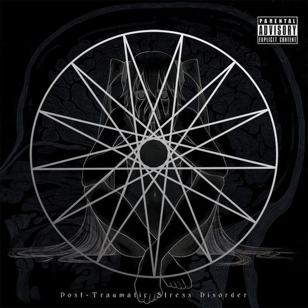

**YouTube:** https://www.youtube.com/watch?v=_THZG2ZgzvU
1. Constipation Of Death (鬱P feat. 初音ミク, 鏡音リン) [0:00](https://www.youtube.com/watch?v=_THZG2ZgzvU&t=0s)
2. 子供の世界, Children's World (鬱P feat. 初音ミク, 鏡音リン) [4:04](https://www.youtube.com/watch?v=_THZG2ZgzvU&t=244s)
3. オトナのオモチャ, Adult's Toy (鬱P feat. 鏡音リン) [7:58](https://www.youtube.com/watch?v=_THZG2ZgzvU&t=478s)
4. THE DYING MESSAGE (鬱P feat. 鏡音リン) [12:38](https://www.youtube.com/watch?v=_THZG2ZgzvU&t=758s)
5. 公衆便所のスミ, in the Public Lavatory's Corner (鬱P feat. 鏡音リン) [17:15](https://www.youtube.com/watch?v=_THZG2ZgzvU&t=1035s)
6. TRAUMATIC (鬱P feat. 初音ミク) [21:18](https://www.youtube.com/watch?v=_THZG2ZgzvU&t=1278s) 
7. 猿は知らない, Monkey Doesn't Know (鬱P feat. 鏡音リン) [21:53](https://www.youtube.com/watch?v=_THZG2ZgzvU&t=1313s)
8. ブラックショータイム, Black Showtime (鬱P feat. 鏡音リン) [25:17](https://www.youtube.com/watch?v=_THZG2ZgzvU&t=1517s)
9. potato-head in wonderland (鬱P feat. 初音ミク) [29:08](https://www.youtube.com/watch?v=_THZG2ZgzvU&t=1748s)
10. 生霊, Wraith [33:00](https://www.youtube.com/watch?v=_THZG2ZgzvU&t=1980s) 鬱P feat. 鏡音リン 
11. 害虫, Vermin (鬱P feat. 初音ミク, 鏡音リン) [37:30](https://www.youtube.com/watch?v=_THZG2ZgzvU&t=2250s)
12. スリープウォーク, Sleepwalk (鬱P feat. 初音ミク, 鏡音リン) [41:24](https://www.youtube.com/watch?v=_THZG2ZgzvU&t=2484s)
13. ドール, Doll (鬱P feat. 初音ミク) [45:52](https://www.youtube.com/watch?v=_THZG2ZgzvU&t=2752s)
14. 般若心経ハードコア, Heart Sutra Hardcore (鬱P feat. 初音ミク) [50:30](https://www.youtube.com/watch?v=_THZG2ZgzvU&t=3030s)
15. Fear! The Speaker People (鬱P feat. 初音ミク) [52:28](https://www.youtube.com/watch?v=_THZG2ZgzvU&t=3148s)

#### GALAPAGOS 2017
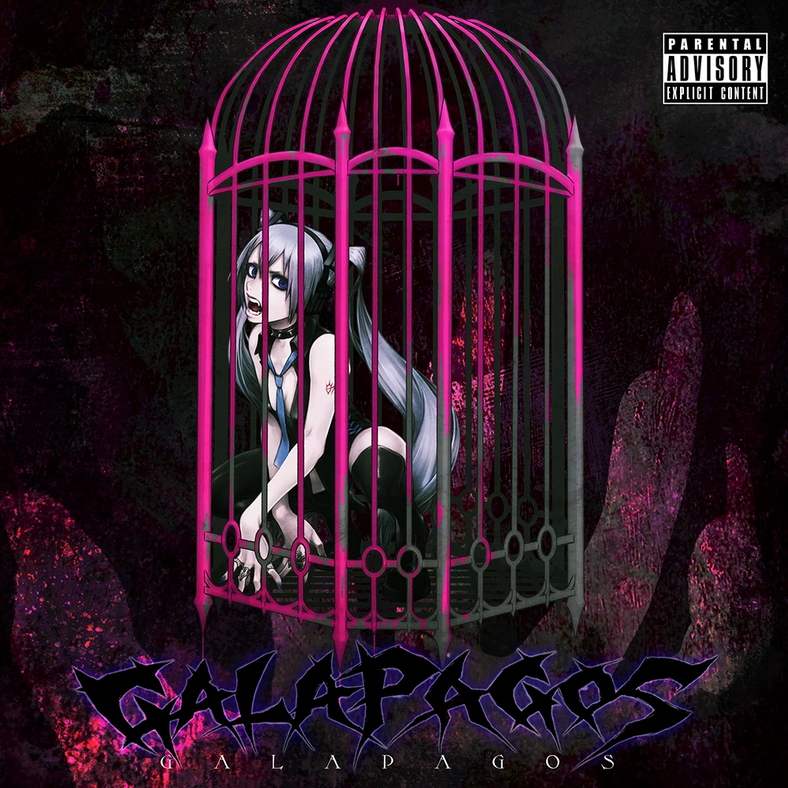

**YouTube:**  https://www.youtube.com/watch?v=bB3QcOX9Vcw
1. [ガラパゴスで悪いか, Is it bad at the Galapagos Syndrome?](https://www.youtube.com/watch?v=dFPN6jIFIgo&t=0s) (鬱P feat. 初音ミク, 鏡音リン) [0:00](https://www.youtube.com/watch?v=bB3QcOX9Vcw&t=0s)
2. [生きてるおばけは生きている, Living Ghost is Alive](https://www.youtube.com/watch?v=QvMNzt3iXyg&t=0s) (鬱P feat. flower) [2:17](https://www.youtube.com/watch?v=bB3QcOX9Vcw&t=137s) ❤
3. [オブラートオブラブ, Sugarcoat of Love](https://www.youtube.com/watch?v=--t6I-zPuns&t=0s) (鬱P feat. 初音ミク) [5:39](https://www.youtube.com/watch?v=bB3QcOX9Vcw&t=339s)
4. [麺屋ぐろてすく, Ramen Shop "GROTESQUE"](https://www.youtube.com/watch?v=Ch6uYySk8sA&t=0s)  (鬱P feat. 鏡音リン) [9:40](https://www.youtube.com/watch?v=bB3QcOX9Vcw&t=580s)
5. [食事, EAT](https://www.youtube.com/watch?v=9ev44z8VAa4&t=0s)  (鬱P feat. 鏡音リン)  [13:25](https://www.youtube.com/watch?v=bB3QcOX9Vcw&t=805s)
6. [HIKIZURI](https://www.youtube.com/watch?v=qPLH-dXbEPM&t=0s)   (鬱P feat. 鏡音リンV4X Power) [17:08](https://www.youtube.com/watch?v=bB3QcOX9Vcw&t=1028s)
7. [未来の夏休み, Summer Vacation in the Future](https://www.youtube.com/watch?v=M9Tw8SVyg-0&t=0s) (鬱P feat. 初音ミク) [21:04](https://www.youtube.com/watch?v=bB3QcOX9Vcw&t=1264s)
8. [飴ちゃん, CANDiES](https://www.youtube.com/watch?v=xB2O7Ul56OY&t=0s)   (鬱P feat. Gumi) [24:38](https://www.youtube.com/watch?v=bB3QcOX9Vcw&t=1478s)
9. [Bonus](https://www.youtube.com/watch?v=mzEHVBEAUxw&t=0s) (鬱P feat. flower) [28:32](https://www.youtube.com/watch?v=bB3QcOX9Vcw&t=1712s)

#### GREATEST SHITS 2018
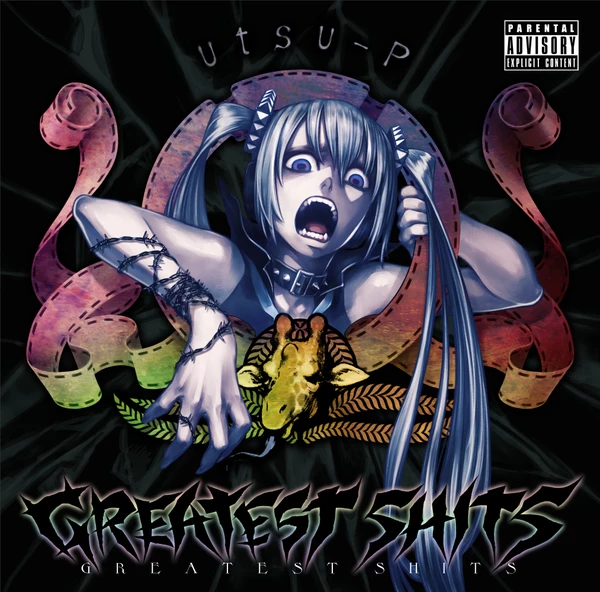

Альбом ремастеров (кроме некоторых треков). 
**YouTube:** https://www.youtube.com/watch?v=Sybi0z3Eltw
1. 骸Attack!!, Corpse Attack!! (鬱P feat. 初音ミク) [0:00](https://www.youtube.com/watch?v=Sybi0z3Eltw&t=0s) ❤
2. アンチ・デジタリズム, Anti-Digitalism  (鬱P feat. 初音ミク) [3:53](https://www.youtube.com/watch?v=Sybi0z3Eltw&t=233s)
3. 自爆, Self-Destruct (鬱P feat. 初音ミク) [8:05](https://www.youtube.com/watch?v=Sybi0z3Eltw&t=485s)
4. 害虫, Vermin (鬱P feat. 初音ミク) [9:16](https://www.youtube.com/watch?v=Sybi0z3Eltw&t=556s)
5. オトナのオモチャ, Adult's Toy (鬱P feat. 鏡音リン) [13:09](https://www.youtube.com/watch?v=Sybi0z3Eltw&t=789s) 
6. THE DYING MESSAGE (鬱P feat. 鏡音リン) [17:47](https://www.youtube.com/watch?v=Sybi0z3Eltw&t=1067s) 
7. 般若心経ハードコア, Hardcore Heart Sutra (鬱P feat. 初音ミク) [22:24](https://www.youtube.com/watch?v=Sybi0z3Eltw&t=1344s) 
8. ブラックホールアーティスト, Black Hole Artist (鬱P feat. GUMI, 鏡音リン) [24:13](https://www.youtube.com/watch?v=Sybi0z3Eltw&t=1453s) 
9. コロナ, Corona (鬱P feat. 鏡音リン) [28:29](https://www.youtube.com/watch?v=Sybi0z3Eltw&t=1709s)
10. 馬鹿はアノマリーに憧れる, Fools Are Attracted To Anomaly (鬱P feat. 鏡音リン) [32:26](https://www.youtube.com/watch?v=Sybi0z3Eltw&t=1946s)
11. チョコレイトオンナノコ, Chocolate Girl (鬱P feat. GUMI) [36:46](https://www.youtube.com/watch?v=Sybi0z3Eltw&t=2206s)
12. Ghost under the Umbrella (鬱P feat. V3 GUMI (Power)) [40:48](https://www.youtube.com/watch?v=Sybi0z3Eltw&t=2448s)
13. 看板娘の悪巫山戯, Poster Girl's Prank (鬱P feat. 鏡音リン, 初音ミク Append (Dark), V3 GUMI (Power)) [45:27](https://www.youtube.com/watch?v=Sybi0z3Eltw&t=2727s) 
14. 皆殺しのマジック, The Magic of the Massacre (鬱P feat. V3 GUMI (Power)) [49:12](https://www.youtube.com/watch?v=Sybi0z3Eltw&t=2952s) 
15. インパーフェクトアニマルズ, Imperfect Animals (鬱P feat. 鏡音リン, V3 GUMI (Power)) [53:31](https://www.youtube.com/watch?v=Sybi0z3Eltw&t=3211s)
16. 絶対音楽で踊れ, Absolute Music Dance (鬱P feat. v flower) [57:10](https://www.youtube.com/watch?v=Sybi0z3Eltw&t=3430s) 
17. 食事, EAT (鬱P feat. 鏡音リン) [1:01:33](https://www.youtube.com/watch?v=Sybi0z3Eltw&t=3693s)
18. 生きてるおばけは生きている, Living Ghost is Alive (鬱P feat. v flower) [1:05:16](https://www.youtube.com/watch?v=Sybi0z3Eltw&t=3916s) 
19. 天使だと思っていたのに, I Thought I Was An Angel (鬱P feat. 初音ミク) [1:08:37](https://www.youtube.com/watch?v=Sybi0z3Eltw&t=4117s) 
20. ぬいぐるみになりたい, I Want to Become a Stuffed Animal (Not remastered) (鬱P feat. MAYU) [1:13:48](https://www.youtube.com/watch?v=Sybi0z3Eltw&t=4428s)
21. しましまメロディ, Shima Shima Melody (鬱P feat. GUMI) [1:18:20](https://www.youtube.com/watch?v=Sybi0z3Eltw&t=4700s)

#### RENAISSANCE 2019
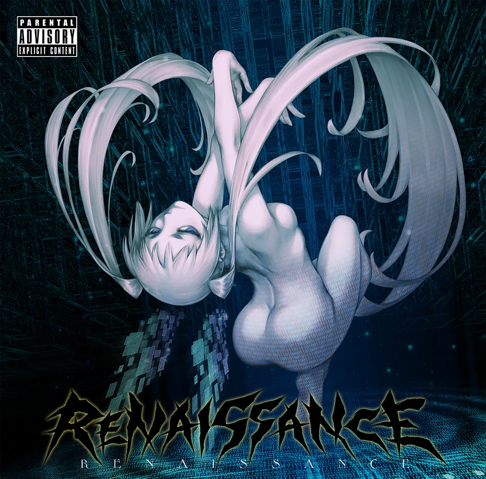

**YouTube:** https://www.youtube.com/watch?v=nK7IBzaAmdE
1. RENAISSANCE  (鬱P feat. 初音ミク) [0:00](https://www.youtube.com/watch?v=nK7IBzaAmdE&t=0s)
2. [The Beautiful Puke](https://www.youtube.com/watch?v=M2FqyOyCbxQ&t=0s) (鬱P feat. 初音ミク) [0:58](https://www.youtube.com/watch?v=nK7IBzaAmdE&t=58s) ❤
3. [ハイパーリアリティショウ, Hyper Reality Show ](https://www.youtube.com/watch?v=Z4LiNMCTV20&t=0s)  鬱P feat. 初音ミク V4X  [4:03](https://www.youtube.com/watch?v=nK7IBzaAmdE&t=243s) ❤
4. [お天道様とドブネズミ, The Sun Goddess and Rat](https://www.youtube.com/watch?v=dDsrLsR3rBA&t=0s) (鬱P feat. 初音ミク) [7:59](https://www.youtube.com/watch?v=nK7IBzaAmdE&t=479s)
5. [毒蜘蛛の娘, Poisonous Spider Daughter](https://www.youtube.com/watch?v=sgDG5BpVbLo&t=0s) (鬱P feat. 初音ミク) [12:10](https://www.youtube.com/watch?v=nK7IBzaAmdE&t=730s)
6. [ゴージャスビッグ対談 [2019], Gorgeous Big Conversation [2019]](https://www.youtube.com/watch?v=gzt_oi9Wg7s&t=0s) (鬱P, ピノキオピー feat. 初音ミク) [15:31](https://www.youtube.com/watch?v=nK7IBzaAmdE&t=931s)
7. [ECHO (remix by 鬱P)](https://www.youtube.com/watch?v=fGogxMC5cd4&t=0s) (鬱P, Fruutella feat. Gumi V3 English)[19:14](https://www.youtube.com/watch?v=nK7IBzaAmdE&t=1154s) 
8. [天使だと思っていたのに, I thought I was an angel](https://www.youtube.com/watch?v=UvUJbhxUKT8&t=0s) (鬱P feat. 初音ミク) [22:41](https://www.youtube.com/watch?v=nK7IBzaAmdE&t=1361s) 
9. [世界中に笑われても, Even if Everyone Around the World Laughed](https://www.youtube.com/watch?v=YrTvzBuNcEg&t=0s) (鬱P feat. 初音ミク) [27:50](https://www.youtube.com/watch?v=nK7IBzaAmdE&t=1670s)
10. Bonus Track (鬱P feat. 初音ミク) [32:45](https://www.youtube.com/watch?v=nK7IBzaAmdE&t=1965s)

#### UNIQE 2021 7/12
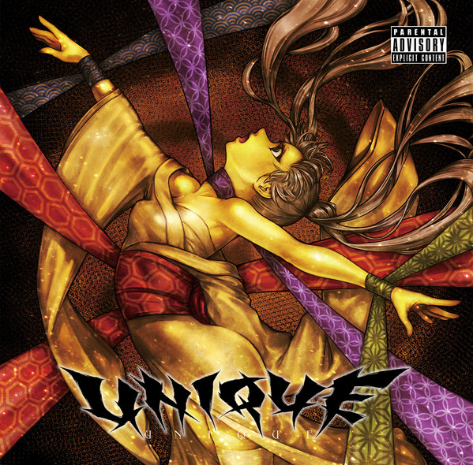

**Трэйлер:** https://www.youtube.com/watch?v=vCOQQpN7ARA
- [2000年3月9日](https://www.youtube.com/watch?v=vO-DciIkNrE)
- [デスロウ / Death of the Law feat. 初音ミク](https://www.youtube.com/watch?v=-tXpwt29GFM) ❤
- [OGRE feat. 初音ミク](https://www.youtube.com/watch?v=N9-M-avUjO8)
- [ぬる / NULL feat. 初音ミク](https://www.youtube.com/watch?v=ksAd0GjaDXk)
-  [映えない / Not Photogenic](https://www.youtube.com/watch?v=GL-FTHmpXqo)
-  [vivid feat. 巡音ルカ×初音ミク](https://www.youtube.com/watch?v=k48L7VD5Q5Q)
-  [ATARI FRONT PROGRAM feat. 可不 [KAFU]](https://www.youtube.com/watch?v=lupVveArye8)

#### EP

##### DOLL 2009
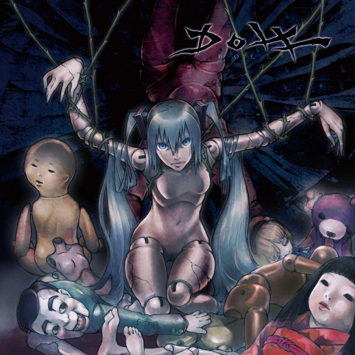

**YouTube:**  https://www.youtube.com/watch?v=d-ieYrP2nOc
1. Doll 【ドール】 (Hatsune Miku) [0:00](https://www.youtube.com/watch?v=d-ieYrP2nOc&t=0s) ❤
2. dope disco (Hatsune Miku) [4:32](https://www.youtube.com/watch?v=d-ieYrP2nOc&t=272s) 
3. Suicide Monster 【Kubikukuri・Monster / クビククリ・モンスター】 (Hatsune Miku) [9:54](https://www.youtube.com/watch?v=d-ieYrP2nOc&t=594s) 
4. Flower 【Hana / 華】(Hatsune Miku) [13:51](https://www.youtube.com/watch?v=d-ieYrP2nOc&t=831s)

##### P 2011

**YouTube:**  https://www.youtube.com/watch?v=w04JwJDSToU
1. Playback 【Saisei / 再生】 (GUMI) [0:00](https://www.youtube.com/watch?v=w04JwJDSToU&t=0s) 
2. Shit 【Daiben / ダイベン】 (Hatsune Miku) [3:52](https://www.youtube.com/watch?v=w04JwJDSToU&t=232s) 
3. Flower 【Hana / 華】 (Hatsune Miku) [7:27](https://www.youtube.com/watch?v=w04JwJDSToU&t=447s) 
4. Fear! The Speaker People (new ver.) 【Kyoufu! Speaker Ningen / 恐怖！スピーカー人間】 (Hatsune Miku) [13:12](https://www.youtube.com/watch?v=w04JwJDSToU&t=792s) 
5. #ffffff (Ito Shirataki) [15:35](https://www.youtube.com/watch?v=w04JwJDSToU&t=935s)

##### Zoku (俗) 2012
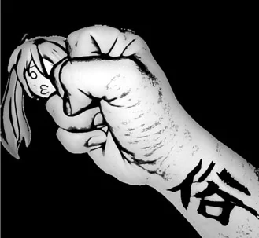

**YouTube:**  https://www.youtube.com/watch?v=rwc9gC60BXc
1. CR Peculiar World View【CR Dokutoku na Sekaikan / CR独特な世界観】(Hatsune Miku) [0:00](https://www.youtube.com/watch?v=rwc9gC60BXc&t=0s) 
2. Red Burst【Akai Baku / あかいばく 】(Hatsune Miku) [3:54](https://www.youtube.com/watch?v=rwc9gC60BXc&t=234s) 
3. Evil thoughts-kun's Theme【Janen-kun no Theme / 邪念くんのテーマ 】(Hatsune Miku, Kagamine Rin, GUMI) [6:05](https://www.youtube.com/watch?v=rwc9gC60BXc&t=365s) 
4. Self-destruction no.2【Jibaku (2go) / 自爆２号】 (Hatsune Miku) [9:51](https://www.youtube.com/watch?v=rwc9gC60BXc&t=591s) 
5. I Want To Become A Stuffed Animal【Nuigurumi Ni Naritai / ぬいぐるみになりたい 】(Mayu) [12:02](https://www.youtube.com/watch?v=rwc9gC60BXc&t=722s)

##### TEYAKI 2014
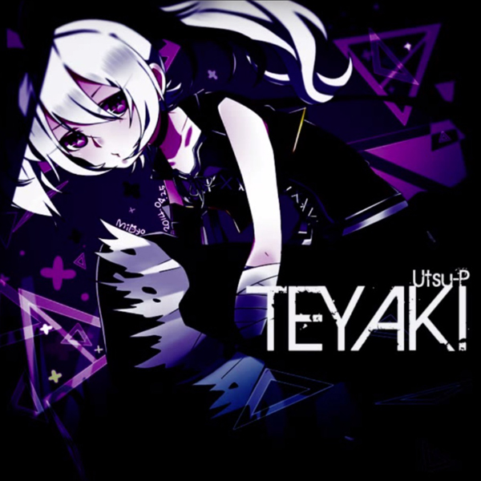

**YouTube:**  https://www.youtube.com/watch?v=CH89J435vbE

1. Teller Story Teller【テラーストーリーテラー】(v flower) [00:00](https://www.youtube.com/watch?v=CH89J435vbE)
2. Self-destruction No. 3【自爆３号】(Hatsune Miku) [03:38](https://www.youtube.com/watch?v=CH89J435vbE&t=218s)
3. Song of mourning【情死の唄】(GUMI) [06:22](https://www.youtube.com/watch?v=CH89J435vbE&t=382s)

## FAQ

> Q: А нахера FAQ?

A: Для разъяснений всех "что?" и "почему?" в дизайне  и содержании документа.

>Q: Что такое "❤"?

A: Мои любимые треки в списке. 

>Q: Что такое "NEW"?

A: Трек, добавленный с последней версией списка. 

>Q: Почему так много вокаметалла?

A: Во первых, я люблю вокаметалл. Во вторых, потому что Ustu-P первый продюссер вокалойдов, с которого я вообще начал интересоваться этой темой. В дальнейшем, колличество продюссеров в документе, использующий голосовые банки с Мику, будет увеличиваться, а так же появиться привязка альбомов к году выпуска (как это сделано с классическими композициями).
>Q: Оглавление будет?

A: Будет, но очень не скоро. Пока очень мало аккумулировал инфы.

 
