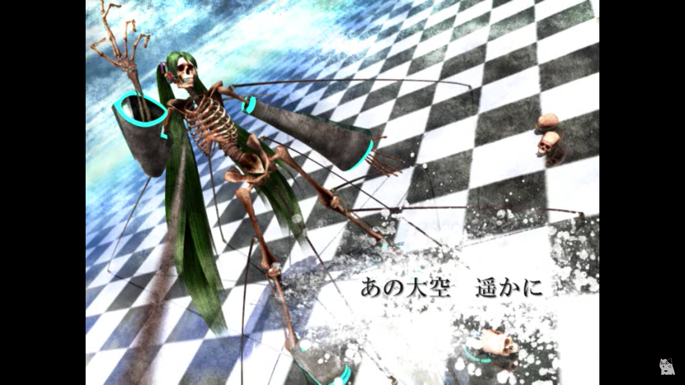
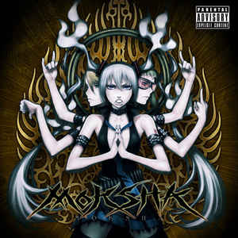

# Hatsune Miku! Список для ознакомления

**Hatsune Miku** (**初音ミク**, транскрипция: Хацунэ Мику, Хатсуне Мику)  — персонаж-маскот одноимённого голосового банка. Входит в состав Character Vocal Series. 

### Общая информация

Несмотря на то, что от версии к версии внешность Hatsune Miku теряла и приобретала некоторые детали, основные черты всегда остаются неизменными. Такими чертами является худое телосложение, большие голубые глаза, длинные хвосты голубого цвета и футуристическая школьная форма, состоящая из рубашки без рукавов, нарукавников, заколок, галстука, короткой юбки и чулков с обувью.

На одежде стоит заострить внимание более подробно, поскольку здесь всё хоть и более-менее стабильно, но всё же некоторые детали меняются в зависимости от версии персонажа. Прежде всего это касается цветовой гаммы элементов одежды. В большинстве версий обувь, чулки и рукава имеют чёрный цвет, юбка — чёрная с голубым обрамлением, а заколки — сиреневые. Разительно отличаются только Append-версия, где галстук также белый, заколки чёрные, а юбки и обуви нет вообще и английская версия для [VOCALOID3](https://vocaloid.fandom.com/ru/wiki/VOCALOID3 "VOCALOID3"), где все элементы чёрного цвета были окрашены в тёмно-синий. Что же касается рубашки, то почти все существующие каноничные версии персонажа имеют рубашку белого цвета и только у стандартной V2-версии она серая.

### История создания

Иллюстратором оригинального внешнего вида Hatsune Miku был KEI. Когда он приступил к работе над внешним видом перед ним была поставлена задача создать иллюстрации Miku, основываясь на цветовой гамме сине-зелёной подписи синтезаторов, а также изобразить её как андроида. Crypton также предложили свою концепцию, однако, им нелегко было объяснить своё видение вокалоида. KEI сказал, что не может нарисовать "поющий компьютер", ибо он даже не имел представления о том, как выглядел синтезатор. На всю работу у него ушло около [месяца](https://vocaloid.fandom.com/ru/wiki/Hatsune_Miku_(%D0%BF%D0%B5%D1%80%D1%81%D0%BE%D0%BD%D0%B0%D0%B6)#cite_note-3). Последующие же версии были созданы руками Masaki Asai (Append-версия), iXima (стандартные вариации для третьего и четвёртого поколения), Zain (английская V3) и Mamenomoto (китайская V4).

Цифровой дизайн юбки и ботинок Miku основан на программных цветах синтезатора, а полоски изображают полоски, взятые из программы по просьбе Crypton. Часть её внешнего вида основана на моделях клавиатуры YAMAHA, особенно [DX-100](https://vocaloid.fandom.com/ru/wiki/Hatsune_Miku_(%D0%BF%D0%B5%D1%80%D1%81%D0%BE%D0%BD%D0%B0%D0%B6)#cite_note-4) и [DX-7](https://vocaloid.fandom.com/ru/wiki/Hatsune_Miku_(%D0%BF%D0%B5%D1%80%D1%81%D0%BE%D0%BD%D0%B0%D0%B6)#cite_note-5). Квадратики вокруг хвостиков являются футуристичными ленточками, созданными из специального материала, который парит в воздухе. Как видно из артов Мику KEI, они способны держать хвостики Мику при этом не соприкасаясь с самими волосами. Также эти самые ленточки считаются деталью, которую сложнее всего изобразить в косплее персонажа.

# Список для ознакомления* 
***далеко не полный, новые редакции ожидайте в дальнейшем**
## Классика (J-POP, EasyPop, DancePop, Electro, Techno)
#### 2008
- [Cleaning Switch (Очищающий переключатель)](https://www.youtube.com/watch?v=5dhcFAhOcbo)
- [Anger (Гнев)](https://www.youtube.com/watch?v=jNFCsJ16crc)
- [Houkiboshi (Комета)](https://www.youtube.com/watch?v=pPhGeDlaMAQ)
#### 2009
- [Nebula feat. Hatsune Miku](https://www.youtube.com/watch?v=hoLu7c2XZYU)
#### 2010
- [Electric Love feat. Hatsune Miku (Электрическая любовь)](https://www.youtube.com/watch?v=fWIbhwMDigM)
#### 2011
- [Baby Maniacs feat. Hatsune Miku (Крошки-маньяки)](https://www.youtube.com/watch?v=ca7QqLHEiLA)
- [Chime (Гармония)](https://www.youtube.com/watch?v=vrshk9Z2kV8)
- [EDEN](https://www.youtube.com/watch?v=yyUCtd6rrWw)
- [Sekiranun Graffiti ft. Hastsune Miku (Граффити грозовых туч)](https://www.youtube.com/watch?v=XKOoIAYSkZQ)
- [Sweet Devil feat. Hatsune Miku (Милый дьявол)](https://www.youtube.com/watch?v=atXcWO54Ek0)
#### 2012
- [Re Boot (Перезагрузка)](https://www.youtube.com/watch?v=3BFvN-idN1s)
- [Bacterial Contamination (Бактериальное заражение)](https://www.youtube.com/watch?v=tktcOUi-x-A)
- [FREELY TOMORROW (Свободное завтра)](https://www.youtube.com/watch?v=KmvydnVTriE)
- [Tell Your World (Расскажи о своём мире)](https://www.youtube.com/watch?v=PqJNc9KVIZE)
- [Yumeyume (Мечта, мечта)](https://www.youtube.com/watch?v=07r67gGbtLQ)
- [Initiation feat. Hatsune Miku (Посвящение)](https://www.youtube.com/watch?v=dIfLTw3tbE8)
#### 2013
- [Redial (Повторный набор)](https://www.youtube.com/watch?v=243vPl8HdVk)
- [GAME OVER feat. Hatsune Miku (Игра окончена)](https://www.youtube.com/watch?v=B5fIvQts65I)
- [TRAPxTRAP feat. Hatsune Miku](https://www.youtube.com/watch?v=c2fqMoTq_tQ)
#### 2014
- [Twinkle World feat. Hatsune Miku (Сверкающий мир)](https://www.youtube.com/watch?v=NiIVTXTuQug)
- [Carry Me Off feat. Hatsune Miku (Унеси меня)](https://www.youtube.com/watch?v=UGG7tUMg77A)
#### 2015
- [Desktop Cinderella feat. Hatsune Miku (Золушка на рабочем столе)](https://www.youtube.com/watch?v=rQCPXcckCaQ)
- [Little Scarlet Bad Girl feat. Hatsune Miku (Маленькая Скарлет — плохая девочка)](https://www.youtube.com/watch?v=I_bs61WyzMk)
#### 2016
- [Blue Star feat. Hatsune Miku (Голубая звезда)](https://www.youtube.com/watch?v=xSnuVnOZd1U)
- [Miku ft. Hatsune Miku](https://www.youtube.com/watch?v=NocXEwsJGOQ)
- [Kimagure Mercy (Причудливое милосердие)](https://www.youtube.com/watch?v=o1iz4L-5zkQ)
#### 2017
- [Suna no Wakusei feat. Hatsune Miku (Песочная планета)](https://www.youtube.com/watch?v=AS4q9yaWJkI)
#### 2018
- [Greenlights Serenade (Серенада зеленых огней)](https://www.youtube.com/watch?v=XSLhsjepelI)
#### 2019
- [Lucky☆Orb feat. Hatsune Miku (Счастливый шар)](https://www.youtube.com/watch?v=AufydOsiD6M)
- [Ring no Seraph (Серафим на ринге)](https://www.youtube.com/watch?v=lWuJRRCTHrg)

## Vocametal (Бери топор - руби хардкоооор)
### Utsu-P 

**Utsu-P** (**鬱P**, Дипрессия-P) (родился 1-ого Декабря 1990), - признанный продюсер, известный своими песнями в стиле вокаметалл.
Хотя вначале в его песнях была исключительно Мику, теперь он также использует Rin, GUMI и flower.
Он хорошо известен своими навыками управления голосом вокалойдов для исполнения выкриков (shouts), криков (screams) и ворчаний (grunts) с помощью фильтров и эффектов, а его мелодия обычно имеет тяжелую басовую линию.
Кроме того, его тексты часто несколько сложны, и их скрытый смысл трудно уловить с первого раза.
Он также является участником и основателем группы **Ohayougozaimasu** (**おはようございます**, **Доброе утро**), и продюссером идол-группы **Zsasz**.

**! ПРИМЕЧАНИЕ !**
Далее в основном будут альбомы вместе с номерами треков (в большенстве учавствовала Мику, поэтому списки треков в альбомах добавлены полностью). 
Вы же не хотите видеть такую поебень из старых клипов (ох ебать):

#### DIARRHEA 2009

**YouTube:**  https://www.youtube.com/watch?v=LGTtqLW4Q-M
 1. Poison☆Apple (Ядовитое яблоко)【ぽいずん☆あっぷる】(Hatsune Miku) [0:00](https://www.youtube.com/watch?v=LGTtqLW4Q-M&t=0s) 
 2. Corpse Attack!! (Атака трупов!!)【Mukuro Attack!! / 骸Attack!!】(Hatsune Miku) [4:18](https://www.youtube.com/watch?v=LGTtqLW4Q-M&t=258s) 
 3. Anti-Digitalism (Анти-дигитализм)【アンチ・デジタリズム】(Hatsune Miku) [8:14](https://www.youtube.com/watch?v=LGTtqLW4Q-M&t=494s) 
 4. Melancholy of Heavy Rain (Меланхолия сильного дождя)【Melancholy Gouu / メランコリー豪雨】(Hatsune Miku) [12:24](https://www.youtube.com/watch?v=LGTtqLW4Q-M&t=744s) 
 5. Shoegaze Life 【シューゲイズ・ライフ】(Hatsune Miku) [16:54](https://www.youtube.com/watch?v=LGTtqLW4Q-M&t=1014s) 
 6. Life with a Sex Doll (Жизнь с секс куклой)【Seimei Zuke Dutchwife / 生命付ダッチワイフ】(Hatsune Miku) [21:14](https://www.youtube.com/watch?v=LGTtqLW4Q-M&t=1274s) 
 7. Desperate Society (Отчаяное общество)【Kakusa Shakai / かくさしゃかい】 (Hatsune Miku) [26:09](https://www.youtube.com/watch?v=LGTtqLW4Q-M&t=1569s) 
 8. Initiative (Инициатива)【イニシアチブ】(Hatsune Miku) [29:49](https://www.youtube.com/watch?v=LGTtqLW4Q-M&t=1789s) 
 9. Welcome to the Love Hospital (Добро пожаловать в больницу любви)【Youkoso Renai Byouin he / ようこそ恋愛病院へ】(Hatsune Miku) [33:45](https://www.youtube.com/watch?v=LGTtqLW4Q-M&t=2025s) 
 10. SHIRONOIR (Hatsune Miku) [37:57](https://www.youtube.com/watch?v=LGTtqLW4Q-M&t=2277s) 
 11. Psychokinesis (Психокинез) (Hatsune Miku) [42:23](https://www.youtube.com/watch?v=LGTtqLW4Q-M&t=2543s) 
12. DIARRHEA (ДИАРЕЯ) (Hatsune Miku) [46:46](https://www.youtube.com/watch?v=LGTtqLW4Q-M&t=2806s) 
13. Sky Burial (Небесное захоронение)【Chousou / 鳥葬】(Hatsune Miku) [51:24](https://www.youtube.com/watch?v=LGTtqLW4Q-M&t=3084s) 
14. Self-destruction (Саморазрушение)【Jibaku / 自爆】(Hatsune Miku) [55:54](https://www.youtube.com/watch?v=LGTtqLW4Q-M&t=3354s)

#### TRAUMATIC 2010

**YouTube:**  https://www.youtube.com/watch?v=YTjvf-HfqkA
1. Constipation Of Death (Запор смерти)  (Kagamine Rin) [0:00](https://www.youtube.com/watch?v=YTjvf-HfqkA&t=0s)
2. Children's World (Детский мир)【Kodomo No Sekai / 子供の世界】 (Kagamine Rin, Hatsune Miku) [4:07](https://www.youtube.com/watch?v=YTjvf-HfqkA&t=247s)
3. Adult's Toy (Игрушка для взорслых)【Otona No Omocha / オトナのオモチャ 】 (Kagamine Rin) [8:00](https://www.youtube.com/watch?v=YTjvf-HfqkA&t=480s)
4. THE DYING MESSAGE (ПРЕДСМЕРТНОЕ СООБЩЕНИЕ)  (Kagamine Rin) [12:24](https://www.youtube.com/watch?v=YTjvf-HfqkA&t=744s) 
5. Public Toilet's Murky Water (Мутная вода в общественном туалете)【Koushuu Benjo No Sumi / 公衆便所のスミ】 (Kagamine Rin) [16:59](https://www.youtube.com/watch?v=YTjvf-HfqkA&t=1019s) 
6. TRAUMATIC (ТРАВМАТИЧЕСКИЙ) (Kagamine Rin) [21:00](https://www.youtube.com/watch?v=YTjvf-HfqkA&t=1260s)
7. Monkey Doesn't Know (Обезьянка не знает)【Saru Wa Shiranai / 猿は知らない 】 (Kagamine Rin, Hatsune Miku) [21:34](https://www.youtube.com/watch?v=YTjvf-HfqkA&t=1294s) 
8. Black Showtime【 ブラック・ショータイム 】 (Kagamine Rin, Hatsune Miku) [25:03](https://www.youtube.com/watch?v=YTjvf-HfqkA&t=1503s)
9. potato-head in wonderland (картофельно-головый в стране чудес) (Hatsune Miku) [28:52](https://www.youtube.com/watch?v=YTjvf-HfqkA&t=1732s) 
10. Wraith (Призрак/Видение)【Ikiryou / 生霊 】 (Kagamine Rin) [32:39](https://www.youtube.com/watch?v=YTjvf-HfqkA&t=1959s)
11. Parasite (Паразит)【Gaichuu / 害虫 】 (Hatsune Miku) [37:08](https://www.youtube.com/watch?v=YTjvf-HfqkA&t=2228s)
12. Sleepwalk (Лунатизм)【スリープウォーク】 (Hatsune Miku) [41:02](https://www.youtube.com/watch?v=YTjvf-HfqkA&t=2462s)
13. Doll (Кукла)【ドール】 (Hatsune Miku) [45:12](https://www.youtube.com/watch?v=YTjvf-HfqkA&t=2712s)
14. Heart Sutra Hardcore (Хардкор сердечной сутры)【Hannya Shingyou Hardcore / 般若心経ハードコア 】 (Hatsune Miku)[49:53](https://www.youtube.com/watch?v=YTjvf-HfqkA&t=2993s) 

#### MOKSHA 2012

**YouTube:**  https://www.youtube.com/watch?v=zDz1RrOMbkk

1. MOKSHA (emancipation) [0:00](https://www.youtube.com/watch?v=zDz1RrOMbkk&t=0s) 
2. 暴動 [0:47](https://www.youtube.com/watch?v=zDz1RrOMbkk&t=47s) 【Boudou / Riot】 (Kagamine Rin, Hatsune Miku) 
3. 馬鹿はアノマリーに憧れる [4:14](https://www.youtube.com/watch?v=zDz1RrOMbkk&t=254s) 【Baka wa Anomaly ni Akogareru / The Fools Are Attracted By Anomaly】 (Kagamine Rin) 
4. 再生 [8:33](https://www.youtube.com/watch?v=zDz1RrOMbkk&t=513s) 【Saisei / Rebirth】 (GUMI) 
5. コロナ [12:25](https://www.youtube.com/watch?v=zDz1RrOMbkk&t=745s) 【Corona】 (Kagamine Rin) 
6. ダルマさんが転んだ気がする [16:21](https://www.youtube.com/watch?v=zDz1RrOMbkk&t=981s) 【Daruma-san ga Koronda Kigasuru / I think Dharma-san Fell】 (GUMI) 
7. ディス・イズ・ラブソング [20:08](https://www.youtube.com/watch?v=zDz1RrOMbkk&t=1208s) 【This is Love Song】 (GUMI) 8. しゃよう [23:47](https://www.youtube.com/watch?v=zDz1RrOMbkk&t=1427s) 【Shayou / For Company】 (GUMI) 
9. 幸福列車に乗ろう [27:55](https://www.youtube.com/watch?v=zDz1RrOMbkk&t=1675s) 【Koufuku Ressha Ni Norou / Riding the Train of Happiness】 (GUMI) 
10. ナナシさんの背比べ [31:52](https://www.youtube.com/watch?v=zDz1RrOMbkk&t=1912s) 【Nanashi-san no Seikurabe / Compared to the Back of the Anonymous】 (GUMI) 
11. 解脱 [35:16](https://www.youtube.com/watch?v=zDz1RrOMbkk&t=2116s) 【Gedatsu / Moksha】 (Kagamine Rin) 
12. ブラックホールアーティスト [38:26](https://www.youtube.com/watch?v=zDz1RrOMbkk&t=2306s) 【Black Hole Artist】(GUMI, Kagamine Rin) 
13. アレグラ [42:43](https://www.youtube.com/watch?v=zDz1RrOMbkk&t=2563s) 【Allegra】 (Kagamine Rin) 
14. ダイヤに乱れはありません [46:28](https://www.youtube.com/watch?v=zDz1RrOMbkk&t=2788s) 【Daiya ni Midare wa Arimasen / There is No Disorder in Diamond】 (GUMI) 
15. まっしろな毒 [50:33](https://www.youtube.com/watch?v=zDz1RrOMbkk&t=3033s) 【Masshiro na Doku / Pure White Poison】(GUMI) 
16. しましまメロディ [57:29](https://www.youtube.com/watch?v=zDz1RrOMbkk&t=3449s) 【Shima Shima Melody / Striped Melody】 (GUMI)

#### GALAPAGOS

**YouTube:**  

**редакция от 06.10.2021**