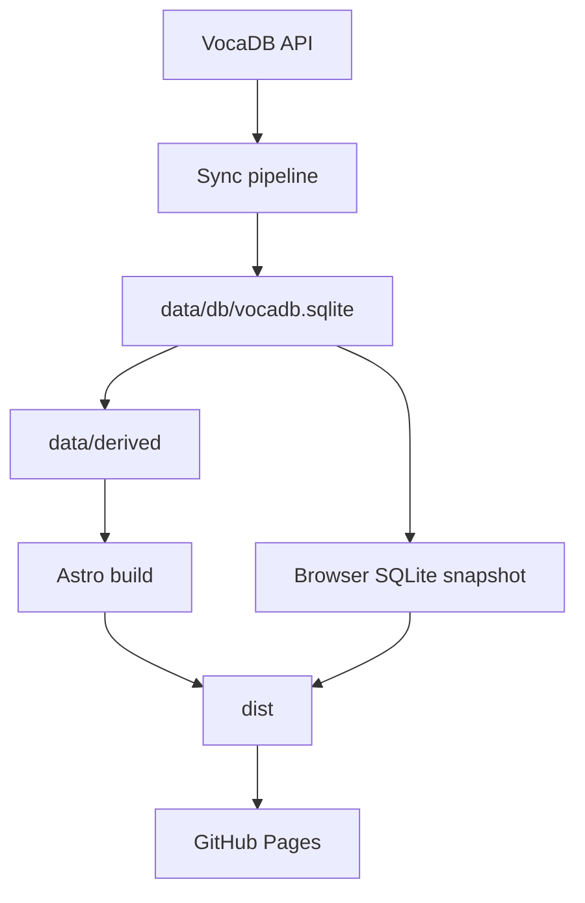

# Документация MyMikuGuide

`MyMikuGuide` - это статический сайт на `Astro`, который публикует локальный snapshot каталога `VocaDB` как GitHub Pages-приложение без выделенного backend-сервера.

## Что читать

- `architecture.md` - устройство сайта, маршрутов, клиентского runtime и структуры репозитория.
- `data-pipeline.md` - как данные попадают из `VocaDB` в `SQLite`, `data/derived`, `dist/` и browser SQLite snapshot.
- `development.md` - локальный запуск, команды, переменные окружения и практический workflow для разработки.
- `operations.md` - `GitHub Actions`, деплой, артефакты, бюджеты, runbook и ограничения продакшн-пайплайна.
- `self-hosted-chat-report.md` - исследование self-hosted альтернатив `Discord` с фокусом на `Matrix`, `Mattermost`, `Rocket.Chat`, мобильные клиенты, системные требования и paywall/лицензионные ограничения.

## Быстрая модель проекта

Почти весь репозиторий можно понимать как следующую цепочку:

1. `VocaDB` выступает внешним источником данных.
2. `scripts/sync/index.ts` синхронизирует и нормализует сущности.
3. Канонический локальный snapshot хранится в `data/db/vocadb.sqlite`.
4. Из SQLite материализуются JSON-экспорты в `data/derived/`.
5. `Astro` использует `data/derived/` на этапе сборки.
6. После сборки дополнительно создаются `dist/pagefind` и browser SQLite snapshot для detail-страниц.
7. `GitHub Pages` публикует итоговый `dist/`.

## Главные каталоги

- `src/` - Astro-страницы, layout-ы, компоненты и runtime-утилиты.
- `scripts/` - sync, экспорт detail JSON, поисковый индекс, budgets и browser SQLite snapshot.
- `data/` - локальная база данных, sync-meta и generated exports.
- `content/` - markdown-архив и коллекции Astro Content.
- `public/` - статические файлы, включая локальные manifest/snapshot-артефакты.
- `.github/workflows/` - двухступенчатый pipeline `sync -> publish`.

## Ключевые принципы

- Source of truth внутри проекта - `data/db/vocadb.sqlite`, а не `data/derived/`.
- `data/derived/` и `data/raw/vocadb/meta/last-run.json` считаются publish/export-артефактами.
- Продакшн detail-страницы ориентированы в первую очередь на browser SQLite snapshot, а не на раздачу `dist/derived/detail`.
- Репозиторий хранит код, конфиг и workflow; тяжёлые generated snapshot-файлы в git игнорируются.
