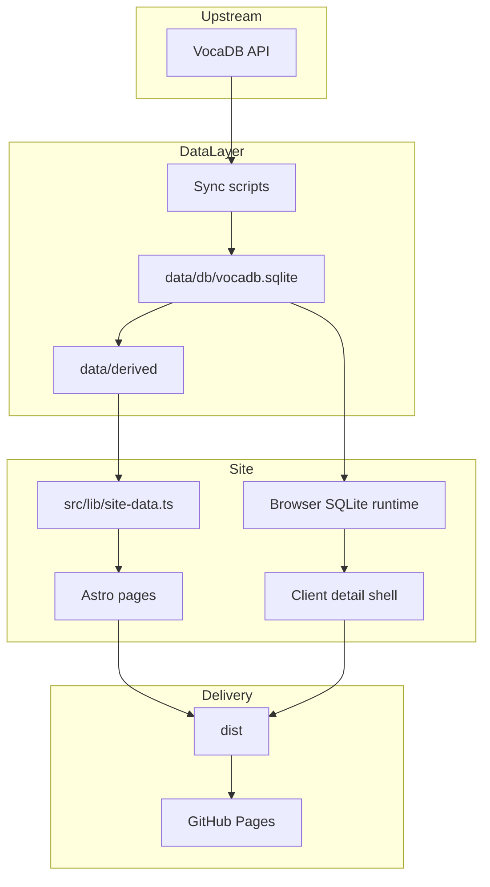

# Архитектура

## Назначение

`MyMikuGuide` публикует статический гид по графу сущностей `VocaDB`: артистам, песням и альбомам. Проект сознательно не зависит от live-запросов к API на пользовательской странице: почти всё готовится заранее в локальном snapshot и затем деплоится на `GitHub Pages`.

## Технологический стек

- `Astro` используется как статический генератор сайта.
- `TypeScript` применяется в sync-скриптах, runtime-утилитах и моделях данных.
- `better-sqlite3` хранит и обслуживает канонический локальный snapshot.
- `sql.js-httpvfs` позволяет читать SQLite в браузере по HTTP range-запросам.
- `Pagefind` строит полнотекстовый поиск по summary-данным.
- `GitHub Actions` запускает синхронизацию и публикацию без отдельного сервера.

## Структура репозитория

- `src/pages/` - маршруты Astro.
- `src/components/` - UI-блоки, например карточки сущностей и client detail shell.
- `src/layouts/` - общий layout сайта.
- `src/lib/` - модели, URL-утилиты, чтение build-time JSON, browser SQLite runtime и клиентский detail-renderer.
- `scripts/` - sync-оркестрация, экспорт detail JSON, build search index, budgets и browser SQLite snapshot.
- `data/` - локальные данные и generated exports.
- `content/` - markdown-контент для content collections.
- `public/` - статические ассеты и локальные preview-артефакты.
- `.github/workflows/` - CI/CD pipeline.

## Слои данных

### Внешний источник

Апстримом выступает `VocaDB API`. Запросы инкапсулированы в `src/lib/vocadb.ts`.

### Каноническое локальное хранилище

Главное локальное хранилище проекта - `data/db/vocadb.sqlite`.

В базе лежат:

- таблицы сущностей `artists`, `songs`, `albums`;
- relation-таблицы `artist_song`, `artist_album`, `album_song`, `artist_relation`;
- служебные таблицы вроде `failed_entities`, `catalog_manifest`, `full_sync_state`, `sync_runs`.

### Publish/export-слой

После sync из SQLite материализуются JSON-данные:

- `data/derived/summary/**` - summary-пейджи каталогов;
- `data/derived/detail/**` - detail JSON;
- `data/derived/meta/routes/**` - route manifest для пагинации;
- `data/derived/meta/*.json` - graph summary и индексы обновлений;
- `data/raw/vocadb/meta/last-run.json` - статистика последнего sync.

Эти файлы не считаются primary storage. Они существуют для сборки сайта и публикации.

## Как сайт потребляет данные

### Build-time слой

`src/lib/site-data.ts` читает JSON из `data/derived/` и `data/raw/vocadb/meta/`. Через него строятся:

- главная страница;
- каталоги артистов, песен и альбомов;
- страницы обновлений;
- часть служебной сводки по последнему sync.

### Runtime слой detail-страниц

Detail-страницы устроены как shell-маршруты:

- `src/pages/artists/view.astro`
- `src/pages/songs/view.astro`
- `src/pages/albums/view.astro`

Они принимают `slug` через query-параметр и загружают detail-данные в браузере.

Источник detail-данных выбирается так:

1. Если доступен manifest browser SQLite snapshot, detail читается прямо из SQLite в браузере.
2. Если snapshot недоступен, используется fallback в `derived/detail/*.json`.

В production pipeline fallback-файлы удаляются из `dist`, поэтому основным runtime-источником для detail-страниц считается именно browser SQLite snapshot.

## Маршруты

Основные страницы сайта:

- `/` - главная и summary по snapshot.
- `/artists/`, `/songs/`, `/albums/` - каталоги сущностей.
- `/artists/view/?slug=...`, `/songs/view/?slug=...`, `/albums/view/?slug=...` - detail-страницы.
- `/search/` - статический поиск на `Pagefind`.
- `/updates/`, `/updates/recent/`, `/updates/today/`, `/updates/new/` - раздел обновлений.
- `/legacy/` и `/legacy/<slug>/` - архивный markdown-контент.

Каталоги генерируются через `getStaticPaths()` и route manifest из `data/derived/meta/routes/`.

## Content collections

`src/content.config.ts` объявляет две коллекции:

- `legacy` - используется реальными маршрутами архива.
- `pages` - заведена как заготовка для `content/pages/*.md`.

На текущий момент `content/pages/about.md` существует, но не подключён к отдельному маршруту и не участвует в опубликованном navigation flow.

## Поиск

`scripts/build-search.ts` строит `Pagefind`-индекс из summary shards. Поиск не обращается к `VocaDB` и не использует серверную БД во время просмотра. Результаты поиска ведут на detail-shell URL.

## Browser SQLite snapshot

`scripts/build-browser-sqlite-snapshot.ts` делает оптимизированную копию `data/db/vocadb.sqlite`, подготавливает `config.json` и публикует manifest:

- production manifest: `dist/meta/db-snapshot.json`;
- локальный preview manifest: `public/meta/db-snapshot.local.json`.

Клиентский runtime для чтения этой БД реализован в `src/lib/browser-sqlite.ts`.

## Архитектурные оговорки

- `astro.config.mjs` жёстко задаёт `site` и `base` под `GitHub Pages`, поэтому при смене owner, repo или custom domain конфиг нужно обновить.
- Detail-маршруты сделаны не как `/<entity>/<slug>/`, а как shell с `?slug=...`, чтобы не раздувать количество HTML-файлов.
- `data/normalized/**` сейчас выглядит как legacy-слой и не является основным рабочим storage в текущей архитектуре.
