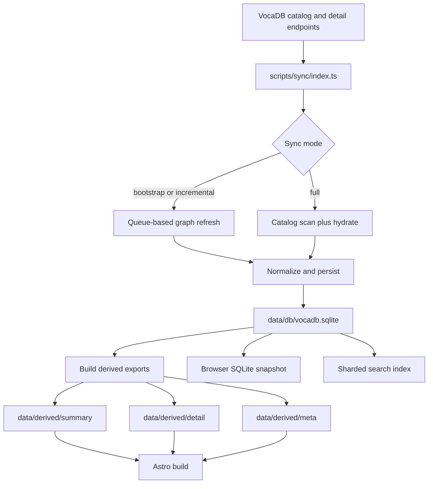
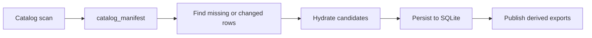
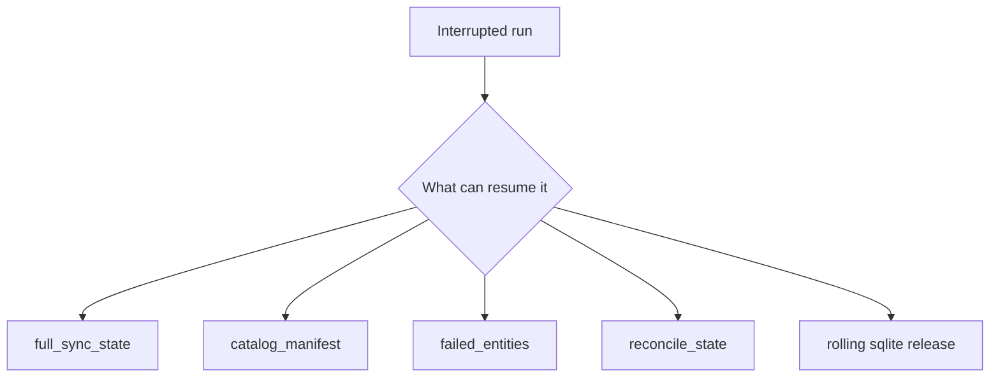

# Пайплайн данных

## Общая схема

Пайплайн данных можно представить так:

1. `VocaDB API` отдает каталожные и detail-данные.
2. `scripts/sync/index.ts` синхронизирует сущности в локальный graph snapshot.
3. Канонический результат записывается в `data/db/vocadb.sqlite`.
4. Из SQLite строятся publish-артефакты в `data/derived/`.
5. `build:derive-meta` генерирует статистику, индексы тегов и годов.
6. Во время `npm run build` сайт собирается из `data/derived/`.
7. Дополнительно создаются `dist/derived/detail`, `dist/search-index` и browser SQLite snapshot.

## Источник истины

- Внешняя истина по каталогу находится в `VocaDB`.
- Внутренняя каноническая копия проекта хранится в `data/db/vocadb.sqlite`.
- `data/derived/` не является source of truth.
- `data/raw/vocadb/meta/last-run.json` не является source of truth.

## Конфигурация sync

Базовый конфиг лежит в `data/raw/vocadb/meta/seeds.json`.

Он задаёт:

- `rootArtistIds`;
- ограничения глубины графа;
- concurrency;
- сетевые таймауты;
- лимиты на горячие сущности и reconcile shards;
- настройки full catalog scan;
- mode-specific overrides.

Локальные override-переменные обычно берутся из `.env`, а CI-профили задаются в `.github/workflows/sync.yml`.

## Режимы синхронизации

### `bootstrap`

Используется для первичного локального наполнения от `rootArtistIds`. Полезен для первого поднятия локального графа.

### `incremental`

Основной сбалансированный режим. Комбинирует root artists, retry failed, hot entities и один reconcile shard.

### `incremental-hot`

Быстрый режим для частых прогонов. Обновляет горячие сущности и не делает reconcile shard.

### `reconcile-shard`

Фоновая равномерная проверка уже известных сущностей по шардированным бакетам. Нужна для постепенного обхода всего каталога.

### `full`

Полная двухфазная синхронизация:

1. catalog manifest scan по `artists`, `songs`, `albums`;
2. hydrate только для changed или missing сущностей.

Этот режим резюмируемый и публикует `derived`-экспорт только после завершённого hydrate.

### `derive`

Пересобирает только `data/derived/` из существующего `data/db/vocadb.sqlite` без обращения к VocaDB. Полезно для регенерации JSON-экспорта после изменения формата.

## Что делает sync

В упрощённом виде `scripts/sync/index.ts` делает следующее:

1. Загружает `seeds`.
2. Настраивает сетевой профиль для `VocaDB`.
3. Выбирает логику queue-based sync или full sync.
4. Получает данные из `VocaDB`, нормализует их и пишет в SQLite.
5. Обновляет relation-таблицы и служебное состояние.
6. Материализует JSON-экспорт в `data/derived/`.
7. Пишет метрики последнего прогона в `data/raw/vocadb/meta/last-run.json`.

## Generated artifacts

### Канонический generated snapshot

- `data/db/vocadb.sqlite`

Это generated-файл, но именно он является основным локальным storage.

### Export-артефакты

- `data/derived/summary/**`
- `data/derived/detail/**`
- `data/derived/meta/routes/**`
- `data/derived/meta/graph-summary.json`
- `data/derived/meta/recently-updated.json`
- `data/derived/meta/updated-today.json`
- `data/derived/meta/new-entries.json`
- `data/raw/vocadb/meta/last-run.json`

### Опциональные raw caches

При `SYNC_STORE_RAW=true` могут появляться сырые compressed payload-файлы в `data/raw/vocadb/artists/`, `data/raw/vocadb/songs/` и `data/raw/vocadb/albums/`.

По умолчанию и в CI этот слой отключён.

## Build-артефакты поверх sync

После `npm run build` дополнительно появляются:

- `dist/derived/detail/**` из `scripts/export-client-detail-data.ts`;
- `dist/search-index/**` из `scripts/build-search-index.ts` (256 JSON-шардов + manifest);
- `dist/sqlite/<version>/**` и `dist/meta/db-snapshot.json` из `scripts/build-browser-sqlite-snapshot.ts`.

Для локального preview аналогичные browser SQLite артефакты могут создаваться в `public/sqlite/` и `public/meta/db-snapshot.local.json`.

## Поисковый индекс

`scripts/build-search-index.ts` читает `data/db/vocadb.sqlite` и строит шардированный JSON-индекс:

- Токенизация: слова из `displayName` и `additionalNames`, плюс romaji-транслитерация через `wanakana`.
- 256 шардов по хешу первых двух символов термина.
- Формат шарда: `{ term: [[code, slug, displayName], ...] }`, где `code` = `a` (artist), `s` (song), `l` (album).
- Выход: `dist/search-index/{0..255}.json` + `manifest.json`.

## Сетевое поведение

`src/lib/vocadb.ts` реализует:

- таймауты запросов;
- retry для `408`, `425`, `429`, `502`, `503`, `504`;
- exponential backoff с jitter;
- обработку `Retry-After`;
- опциональный `forceIPv4` через `undici`.

Это критично для длинных sync-прогонов и CI-сценариев.

## Resume и recovery

В проекте уже заложены механизмы продолжения работы после незавершённого прогона:

- `failed_entities` хранит проблемные элементы для повторных попыток.
- `reconcile_state` позволяет продолжать shard-by-shard обход каталога.
- `catalog_manifest` хранит состояние hydrate-кандидатов.
- `full_sync_state` хранит курсор фаз `scan` и `hydrate`.
- rolling release с `vocadb.sqlite` даёт warm start следующему CI sync.

## Partial derive rebuild

Derive-стадия поддерживает инкрементальное обновление. Инварианты:

- **Delta scope**: при малом количестве изменений derive пересобирает только затронутые summary-страницы и detail-файлы, не делая работы масштаба всего каталога.
- **Touched expansion**: из прямых changed-сущностей автоматически расширяются связанные через relation-таблицы (artist↔song, artist↔album, album↔song, artist↔artist).
- **Summary page mapping**: номера summary-страниц для touched-сущностей хранятся в `derive_route_state` (SQLite), а не берутся из полного route manifest JSON.
- **Route state persistence**: после каждого успешного summary rebuild обновляется `derive_route_state` и `derive_meta`.
- **Fallback в full rebuild**: если `derive_meta` отсутствует, не совпадает по `total_items`/`total_pages`, или если изменился порядок сортировки (новые/переименованные сущности), пересобираются все summary-страницы.

### Stage-level телеметрия

В конце derive логируется разбивка по стадиям:

- `touched_expansion` — время расширения графа из дельты
- `meta_queries` — time для counts, recent summaries, updated today
- `summary_rebuild` — время пересборки summary-страниц
- `detail_rebuild` — время пересборки detail-файлов (с количеством)
- `total` — общее время derive

Также выводятся `detailsWritten` и `noOpWrites` для оценки эффективности.

## Важные caveats

- Если browser SQLite snapshot недоступен в production, detail-страницы могут деградировать, потому что fallback JSON удаляется из Pages artifact.
- При `SYNC_STORE_RAW=false` probe-оптимизация работает слабее, чем при сохранении raw cache.
- В текущей архитектуре не видно полноценного delete-flow для сущностей, исчезнувших из апстрима.
- `data/normalized/**` существует как legacy-слой и может участвовать только в transitional import path.
