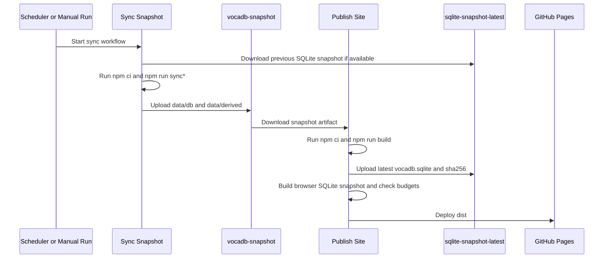
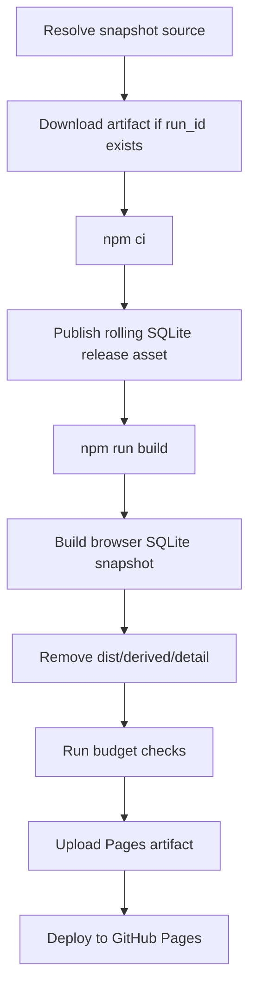

# Эксплуатация и CI/CD

## Общая схема pipeline

Продакшн-пайплайн разбит на два workflow:

1. `Sync Snapshot` в `.github/workflows/sync.yml`
2. `Publish Site` в `.github/workflows/publish.yml`

Они соединены по схеме `sync -> workflow artifact -> publish -> GitHub Pages`.

## Workflow `Sync Snapshot`

Этот workflow:

- запускается по расписанию и вручную;
- выбирает sync-режим в зависимости от `schedule` или `workflow_dispatch`;
- пытается скачать предыдущий rolling SQLite snapshot для warm start;
- выполняет `npm ci`;
- запускает нужную `npm run sync*` команду;
- публикует артефакт `vocadb-snapshot`.

### Расписание

- `20 */6 * * *` -> `incremental-hot`
- `50 3 * * *` -> `reconcile-shard`

Во всех остальных случаях по умолчанию используется `incremental`.

### Что содержит `vocadb-snapshot`

- `data/db`
- `data/derived`
- `data/raw/vocadb/meta`

То есть publish-стадия получает и канонический SQLite snapshot, и JSON-экспорт, и метрики последнего прогона.

## Workflow `Publish Site`

Этот workflow:

- запускается после успешного `Sync Snapshot` через `workflow_run`;
- может быть запущен вручную через `workflow_dispatch`;
- при необходимости скачивает `vocadb-snapshot` по `run_id`;
- выполняет `npm ci`;
- публикует rolling release asset с `vocadb.sqlite`;
- собирает сайт;
- создаёт browser SQLite snapshot для Pages;
- удаляет `dist/derived/detail`;
- проверяет бюджеты;
- деплоит `dist` в `GitHub Pages`.

## SQLite snapshot в двух формах

### Rolling release asset

`publish.yml` публикует:

- `vocadb.sqlite`
- `vocadb.sqlite.sha256`

в релиз с тегом `sqlite-snapshot-latest`.

Этот артефакт нужен:

- следующему `sync` для warm start;
- внешним потребителям snapshot;
- проверке целостности через SHA-256.

### Browser SQLite snapshot

`npm run build:browser-sqlite-snapshot` подготавливает browser-совместимую копию БД и manifest, которые потом потребляет клиентский runtime на detail-страницах.

В production это файлы внутри `dist/sqlite/...` и `dist/meta/db-snapshot.json`.

## Budget checks

После сборки выполняется `npm run check:budgets`.

По умолчанию pipeline следит за:

- временем build не более `900` секунд;
- размером `data/derived` не более `367001600` байт;
- размером `dist` не более `419430400` байт;
- количеством detail JSON-файлов не более `50000`.

## Runbook

### Первый запуск CI

Если rolling release ещё не существует, `sync` продолжит работу в cold start режиме. Это штатное поведение.

### Как вручную опубликовать сайт

Есть два сценария:

1. Передать `snapshot_run_id` существующего sync-run и использовать его artifact.
2. Не передавать `snapshot_run_id` и надеяться на локальные snapshot-файлы в checkout.

Практически безопаснее всегда использовать первый вариант.

### Что делать при проблемах с detail-страницами

Проверьте по порядку:

1. создан ли `data/db/vocadb.sqlite`;
2. создался ли browser SQLite snapshot;
3. существует ли manifest `dist/meta/db-snapshot.json` или `public/meta/db-snapshot.local.json`;
4. не был ли удалён fallback `dist/derived/detail` до того, как runtime смог использовать SQLite.

### Что делать при слишком долгом или тяжёлом sync

- уменьшите `SYNC_CONCURRENCY`;
- ограничьте `SYNC_MAX_NEW_ENTITIES_PER_RUN`;
- используйте `incremental-hot` вместо `full`, если полная сверка не нужна;
- проверьте таймауты `SYNC_PROBE_TIMEOUT_MS`, `SYNC_FETCH_TIMEOUT_MS`, `SYNC_ID_LOOKUP_TIMEOUT_MS`;
- включите `SYNC_LOG_PROGRESS=true`, чтобы видеть прогресс.

## Ограничения и риски

- Rolling release `sqlite-snapshot-latest` перезаписывается и не является историческим журналом релизов.
- `vocadb-snapshot` живёт ограниченное время, поэтому старый `snapshot_run_id` может стать непригодным.
- Ручной `publish` без `snapshot_run_id` не гарантирует полноценный deploy на чистом runner.
- Production detail-страницы зависят от browser SQLite snapshot, потому что detail JSON удаляется из Pages artifact.
- `astro.config.mjs` жёстко привязан к `https://tokuseihagane.github.io/MyMikuGuide/` и `base: "/MyMikuGuide"`.
- В CI нет отдельного тестового stage, а `npm run check` сейчас не встроен в workflows.

## Файлы, которые стоит знать оператору

- `.github/workflows/sync.yml`
- `.github/workflows/publish.yml`
- `scripts/sync/index.ts`
- `scripts/build-browser-sqlite-snapshot.ts`
- `scripts/check-budgets.ts`
- `.env.example`
- `.gitignore`
- `astro.config.mjs`
